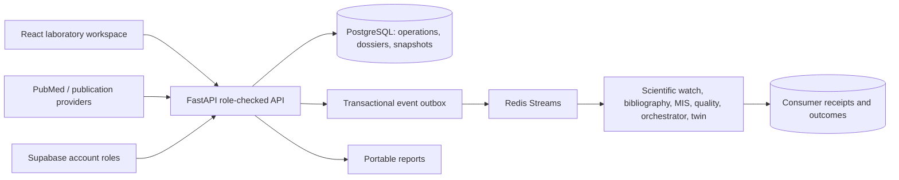

# Supervisor handover — research workflow release

## What the platform contributes

The platform connects research monitoring, project operations, evidence-linked findings and accountable review. It also offers reviewed parcel-water decision support. Software verification is separate from scientific validation: there is still no independent local-field evidence establishing predictive accuracy or water savings.

| Upgrade | Delivered behavior | Evidence / remaining condition |
|---|---|---|
| Connected demonstration | Question → selected source → deliverable → synthetic baseline comparison → finding → feedback → revised approval | `scripts/verify_project_dossier.py`, isolated synthetic DB |
| Supervisor workflow | Preserved submission snapshot, changes requested/approval, reviewer identity, time and mandatory feedback; no self-review | API regression and synthetic walkthrough; not a legal signature |
| Evidence-linked findings | Findings reference project literature, deliverables and evaluations; limitations required | Cross-project evidence rejected; author assessment is not automatic appraisal |
| Evaluation workspace | Paired model/baseline MAE, RMSE and bias; units, protocol, provenance and development/held-out labels | Known-value tests; field origin and held-out independence remain user declarations |
| Installation and recovery | Full localhost Compose demo; migrations, readiness, persistent PostgreSQL/Redis, backup and isolated restore checks | Docker unavailable locally; package/recovery CI added but not yet executed here |
| Attention dashboard | Pending reviews, overdue deliverables and open risks; route to Research Projects | Lab-wide scope, not individual assignment filtering |
| Bibliographic trust | Manual identifier-review history; identifier changes invalidate current confirmation; metric provider and retrieval time | Provider provenance regression; metric accuracy and name-based matches still need review |
| Agent visibility | Recent transport events plus per-agent consumer outcomes; explicit failure retry for administrators | Existing delivery fault-injection tests; real broker test provided, not executed locally |
| User experience | Saved/unsaved states, stale-save errors, source-sharing explanation, progressive disclosure for evaluations/reviews | Desktop browser checks; broader mobile/accessibility assessment remains |
| Submission package | Current scope, architecture, demo steps, role explanation, verification boundaries and operating commands | This document plus the release/deployment guide |

## Architecture

The isolated local demo bypasses account authentication and uses a dev administrator; real laboratory access must use configured authentication. The two reviewer identities in the generated walkthrough are explicit test fixtures injected by the demonstration script, not real accounts or endorsements. No role-switching endpoint is added to the application.

## Ten-minute demonstration

1. State the question: which monitoring approach should the lab evaluate? Explain that this demonstration contains synthetic data.
2. Open Research Projects and select the latest `DEMO — Water-quality research dossier` under Laboratory operations.
3. Show the project deliverable and the dossier's questions, methods and missing field evidence.
4. Show the selected source and project rationale. Explain that private literature-review notes are not copied into the shared dossier. The generated walkthrough uses a synthetic citation; the separate PubMed live check demonstrates real retrieval.
5. Expand Evaluation workspace. Two paired synthetic values give model MAE/RMSE 1 and baseline MAE/RMSE 3. This verifies the calculation, not a scientific advantage.
6. Show the finding linked to its source, deliverable and evaluation. Read its limitation.
7. Inspect the first submission with requested changes. Inspect the revised approved submission and the recorded feedback. Explain that approval applies only to that preserved version.
8. Edit the working dossier; the historical submission remains unchanged. Save before another submission.
9. Export a reviewed submission. The report includes the decision, reviewer, timestamps and snapshot checksum. The checksum is an integrity identifier, not a cryptographic signature.
10. Open Dashboard → Needs attention and the administrator delivery panels. Explain transport acknowledgement versus consumer processing. Finish with the remaining scientific and deployment evaluation work.

## Roles and access

Viewers read internal records; researchers edit and submit; reviewers and administrators decide on other users' submissions. The MIS uses laboratory-wide internal access, not project-member ACLs. Identity confirmations require reviewer/administrator permission. Direct browser access to new database tables is not granted. Production authentication, PostgreSQL RLS and multiple-worker behavior need deployment verification before rollout.

## Scientific boundaries

- No local measurements are fabricated as real-field evidence.
- Uploaded/pasted paired values do not establish provenance or held-out independence by themselves.
- A lower error on synthetic/development data cannot support field accuracy or water-saving claims.
- Bibliometric sources can resolve names incorrectly; manual identifier confirmation does not certify all linked papers or citation counts.
- Dossier approval is a recorded human decision, not scientific certification.
- Submission snapshots are immutable through the application API. A database administrator can still modify database contents; signed archival storage is not implemented.

## Remaining decisions for the laboratory

Agree the real evaluation dataset and reference method, reviewer accounts, project-access expectations, hosting operator and backup retention policy. GIS, full hydrological engines, multi-domain optimization, comprehensive accounting and thesis supervision remain outside this release.

## Verification record (17 September)

30 offline regression tests passed in 19.685 seconds, including the local SQLite backup/restore check. TypeScript and production frontend build passed, with the existing large-bundle advisory. Browser checks confirmed saving a proposed finding, submitting revision 6 while preserving approved revision 5, displayed evaluation metrics, pending-review dashboard entry and transport/consumer summaries. See research-release-2026-09-17-evidence.json. Independent-account decisions were exercised through test fixtures, not a live authenticated supervisor session. The browser export download/print layout was not verified.

Follow-up workflow improvements: see WORKFLOW-UPGRADES-2026-09-17.md for guided project setup, budget history, direct paper sharing, publication checks, parcel traceability, version comparisons and deployment preflight. These extend the earlier release; deployment and field-science verification remain outstanding.
